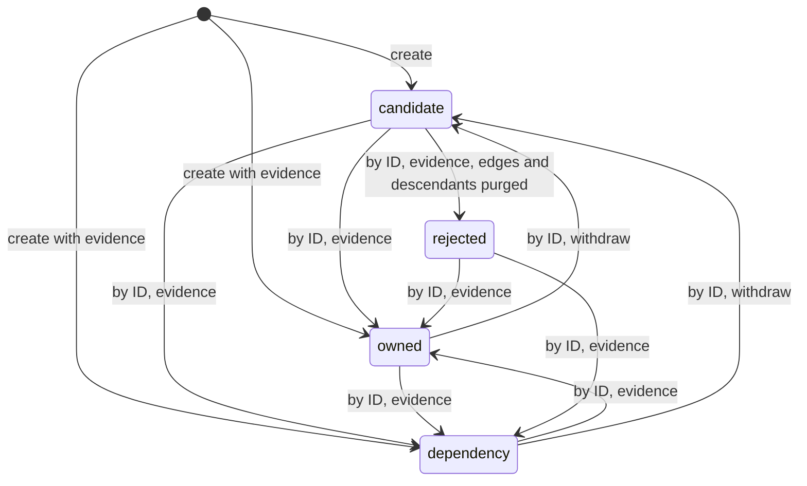
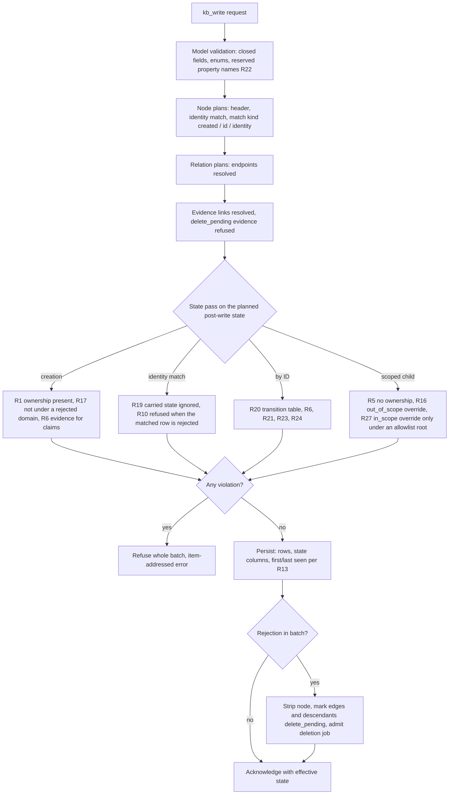

# Engagement Inventory State - Plan

## Goal Capsule

- **Objective:** An agent working an engagement can tell, for every asset in the graph, whether it belongs to the target, is third-party infrastructure the target depends on, or is still an unconfirmed candidate, and whether it is authorized for active testing. Unrelated assets of other organizations stay out of the graph.
- **Means:** Server-managed inventory metadata on graph records, enforced on the write path and exposed on every read surface (KTD1, KTD3).
- **Product authority:** The Product Contract wins on behavior, and the Planning Contract wins on mechanism within it. The scope is inventory state only. The existing-type fixes and new asset types found by the same catalog review are not active scope; see How This Work Fits Together.
- **Stop conditions:** Stop and ask if implementation shows that a transition in R20 cannot be enforced without breaking an existing atomic-write guarantee, or that a v3 workspace has been deployed since 2026-09-22.
- **Execution profile:** One feature branch and one PR carrying a breaking catalog and schema cut. The commits follow the unit order below, and each passes `make check`.
- **Open blockers:** None.

---

## Product Contract

Product Contract preservation: changed. R3, R5, R9, R13 and R14 are clarified or narrowed, and R16–R25 are added from planning research; the user confirmed these at the planning synthesis. R23 is narrowed to reliance relations, and R26, R27 and R28 are added from document review; R16 and R20 gain the allowlist widening. The user approved each. The two brainstorm assumptions are resolved into R20, and the Outstanding Questions are resolved into R and KTD entries.

### Summary

Inventory state lives in dedicated columns beside the existing record metadata. The catalog declares which node types carry it, which inherit it and which have none, and preflight enforces every rule before a row is written. Classifying an existing node is an ID-addressed act, so a scanner rescan never changes a classification. Rejection strips a candidate to its catalog-required identity immediately and purges its edges and descendants through the existing deletion-job machinery. The state reaches agents through `kb_write` acknowledgements, `kb_get`, `kb_search`, `kb_neighbors`, `kb_types` and a new server instructions string.

### Problem Frame

Catalog v3 checks what a value is, never whose it is. One deployment owns one workspace and one engagement (`docs/index.md`), yet nothing in the graph separates the target's assets from the CDN, SaaS and hosting infrastructure it runs on. Nothing separates those from strangers reached by pivoting through that shared infrastructure. The only declared confidence is `finding.confidence`. The graph guide's example writes an undeclared `"status": "observed"` property that the server stores unvalidated (`docs/guides/graph.md`).

Every external attack-surface model surveyed carries this state. Defender EASM uses Approved, Candidate, Dependency, Monitor only and Requires investigation. Censys uses seeds and a confidence threshold. OWASP Amass OAM attaches a source and confidence to each asset. BBOT tracks `scope_distance`. Without it, an agent cannot tell which assets it may test, and a pivot through a shared IP writes another company's data into the engagement.

Time has the same gap. `observed_at` is last-writer-wins (catalog review D-18), and a patch that omits it resets it to the current time (`src/justpen_knowledgebase_mcp/storage/graph.py`). The graph therefore cannot say reliably when an asset was first or last seen, and dangling-DNS detection depends on that.

### Actors

- A1. Recon agent: an MCP client that writes scanner results, classifies assets and decides what to test next.
- A2. Operator: the human running the engagement, who supplies the rules-of-engagement document and reviews classifications.
- A3. MCP server: enforces the rules below on every write.

### Key Decisions

- **Three classes of foreign asset, and only two are written.** The target's own assets and the third-party infrastructure it depends on are written. Unrelated neighbors stay in evidence only. Dependencies must be nodes because subdomain-takeover and dangling-DNS findings attach to them. Governs R1, R11. (session-settled: user-directed — chosen over writing only verified assets and over writing only the target's own assets: dependencies are needed for takeover detection, and uncertain assets need a home while attribution is pending)
- **Ownership and authorization are separate axes.** A contract can exclude an owned system or include a permitted third-party one, so `owned` must never read as permission to scan. Governs R3, R4, R16. (session-settled: user-directed — chosen over ownership only and over one merged state list: a merged list multiplies combinations, and ownership alone invites unauthorized testing)
- **The server requires a state; the agent chooses it.** The server cannot know who owns an asset. It can only refuse a write that makes no claim, or a claim that has no evidence. Governs R1, R5. (session-settled: user-directed — chosen over server-checked reachability from seeds, which would constrain write order, and over an optional agent-only convention)
- **Every claim needs evidence.** Moving out of `candidate` and setting an authorization marker are attribution and contract claims, and a wrong one leads an agent to test someone else's asset. Governs R6, R8, R21. (session-settled: user-directed — chosen over free changes with a transition log and over free last-writer-wins changes)
- **A rejected candidate keeps its identity only.** Keeping the identity stops the same pivot from re-adding the same name as a candidate on every scan. Removing everything else keeps the other organization's data out. Governs R9, R10, R17. (session-settled: user-directed — chosen over full deletion, which repeats attribution work, and over a separate deny list outside the graph)
- **Inventory state is server-managed metadata, not a catalog property.** All the rules concern the write itself (evidence, irreversibility, ordering), not the value, and `observed_at` already lives outside `properties`. Governs R2, R14, R22. (session-settled: user-directed — chosen over declaring `ownership` and `scope` properties on every asset type, which property checks cannot tie to evidence links)
- **First and last seen become monotonic.** This closes catalog review D-18. Governs R12, R13. (session-settled: user-directed — chosen over deferring time and over adding a "gone" observation now)
- **Rescans never reclassify.** Agents upsert scanner batches by identity without knowing whether a node exists, and those batches always carry evidence, so the evidence gate alone would not stop a rescan from overwriting a reviewed classification. Governs R19, R20. (session-settled: user-approved — chosen over letting identity upserts change state when they carry evidence: every scanner import carries evidence, so that gate would not protect reviewed classifications)
- **Allowlist contracts are modeled, not assumed away.** A contract naming only ports 80 and 443 must not leave a later-discovered port testable. Governs R16, R20, R27. (session-settled: user-directed — chosen over documenting that authorization assumes a deny-list contract: the agent would still see excluded ports as testable)
- **An older observation never replaces newer data.** Monotonic last seen would otherwise stamp stale property values as current. Governs R28. (session-settled: user-directed — chosen over keeping last-writer-wins properties and documenting oldest-first imports)
- **Rules-of-engagement exclusions can narrow below the host.** A contract that excludes port 22 on an in-scope host must not leave that service listed as testable. Governs R5, R16. (session-settled: user-approved — chosen over children that only inherit: pure inheritance lists excluded services as `in_scope`)

### Requirements

**Classification**

- R1. A write that creates a node of a state-bearing type must give an ownership state of `owned`, `dependency` or `candidate`; the server rejects a creation without one.
- R2. Ownership and authorization are server-managed metadata outside `properties`, and the catalog declares which node types carry them; a property patch or `remove_properties` cannot change them.
- R3. Authorization is a separate marker with the values `in_scope`, `out_of_scope` and `unknown`, and it is `unknown` when the creating write does not set it.
- R4. The documentation and the agent-facing tool text state that only `in_scope` authorizes active testing, and that `owned` and `unknown` do not; the server performs no testing, so the agent enforces this rule.
- R5. Vocabulary and shared-record types carry no state, and parent-scoped children inherit their parent's ownership instead of setting their own.
- R16. A parent-scoped child may narrow its authorization to `out_of_scope` with evidence, and a child's effective authorization is the most restrictive value along its scope chain, except as R27 widens it.
- R27. An `in_scope` state-carrying node may be marked allowlist-scoped with evidence. Its scoped descendants are then effectively `out_of_scope` unless an ID write with evidence widens the descendant, or an ancestor between it and the root, to `in_scope`.

**Transitions**

- R19. A write that matches an existing node by identity never changes that node's ownership or authorization; the values it carries apply only when it creates the node.
- R20. Ownership and authorization of an existing node change only through a write addressed by its ID, following the transition table below; a refused transition names the current state.

| From | To | Allowed | Evidence in the same write |
|---|---|---|---|
| (new) | `candidate` | yes | no |
| (new) | `owned`, `dependency` | yes | yes |
| `candidate` | `owned`, `dependency` | yes | yes |
| `candidate` | `rejected` | yes | yes |
| `owned` | `dependency`, and back | yes | yes |
| `owned`, `dependency` | `candidate` | yes | no |
| `owned`, `dependency` | `rejected` | no; withdraw to `candidate` first | — |
| `rejected` | `owned`, `dependency` | yes | yes |
| `rejected` | `candidate` | no | — |
| any authorization | `in_scope`, `out_of_scope` | yes, except on `rejected` | yes |
| any authorization | `unknown` | yes, except on `rejected` | no |
| scoped child override | `in_scope` | only under an allowlist-scoped root (R27) | yes |
| allowlist marker on an `in_scope` root | set or cleared | yes | yes |

**Evidence gating**

- R6. Setting ownership to `owned`, `dependency` or `rejected`, or authorization to `in_scope` or `out_of_scope`, requires at least one evidence link on that node in the same write; without one the whole write is rejected.
- R21. A write, or an evidence deletion, that would leave a node holding a claim (`owned`, `dependency`, `rejected`, `in_scope` or `out_of_scope`) with no evidence link is refused.

**Rejection**

- R7. A candidate found to be neither the target's asset nor a dependency moves to `rejected`.
- R8. Moving to `rejected` requires at least one evidence link on that node in the same write, recording why.
- R9. On rejection the server keeps the node's identity properties, the other properties its catalog type requires, its evidence links and its first/last seen. It removes the other properties, the label, its relations and its scoped descendants, and resets authorization to `unknown`.
- R10. A write that would create a node matching a rejected identity is refused, and the error names the existing rejected record.
- R17. A write that would create a `subdomain` under a registrable domain that is a rejected `domain` node is refused in the same way.
- R18. Deleting a rejected record with `kb_delete` is an explicit purge: it lifts the re-creation block, and the tool text says so.
- R23. Rejection is refused while an `owned` or `dependency` node has a reliance relation to the candidate (`cname_to`, `dname_to`, `has_nameserver`, `has_mail_exchange`, `has_soa_primary`, `has_srv_target`, `has_svcb_binding`, `resolves_to`, `hosted_on`, `backed_by_bucket` or `federates_with`), because such a candidate is a dependency; the error names the blocking relation. Containment and discovery relations such as `contains_ip`, `contains_cidr`, `covers_name`, `reverse_resolves_to`, `links_to`, `redirects_to`, `operated_by` and `announced_by` do not block, and are purged with the rejection.
- R26. A batch that hits rejected identities under R10 or R17 is refused once, and the error names every such item address with its rejected record; the agent-facing text tells agents to filter scanner batches against `ownership=rejected` before writing.
- R24. A write that rejects a node and also touches that node's relations or scoped descendants, or adds relations or children to a rejected node, is refused.
- R11. Agents do not write unrelated neighbors as nodes; the documentation tells them to leave such assets in evidence.

**Observation time**

- R12. Every node and relation carries a first-seen and a last-seen time: the earliest and latest observation any write has reported. An older observation never moves either one backward.
- R13. A write reports an observation when it creates the record, supplies `observed_at`, or changes properties. A write that only changes ownership, authorization, label, source or evidence links does not advance first or last seen.

- R28. A write whose observation time is earlier than the record's stored last seen may lower first seen and add properties the record lacks; it neither overwrites nor removes an existing property value.

**Discovery and search**

- R14. Agents can filter node reads by effective ownership and effective authorization, and every read surface and the catalog discovery response show the state.
- R25. Default node search leaves out `rejected` records; they are returned when the ownership filter asks for them or when read by ID.
- R22. The property names `ownership`, `authorization`, `first_seen` and `last_seen` are refused inside `properties`, and the error points to the top-level field.

**Compatibility**

- R15. The change is a clean catalog and schema cut: an existing v3 workspace is refused at startup with the existing contract-mismatch error, as earlier cuts were.

### Key Flows

- F1. Candidate lifecycle
  - **Trigger:** A pivot (subfinder, certificate SAN, reverse DNS) yields an asset whose owner is unknown.
  - **Actors:** A1, A3
  - **Steps:** A1 writes the asset as `candidate` without evidence of ownership. A1 attributes it using RDAP, WHOIS, DNS or certificate evidence. A1 reclassifies it by ID as `owned`, `dependency` or `rejected`, and attaches that evidence in the same write.
  - **Outcome:** An `owned` or `dependency` asset keeps its data and relations. A `rejected` asset keeps its identity and evidence only, and a later pivot to the same identity is refused.
  - **Covered by:** R1, R6, R7, R8, R9, R10, R19, R20

- F2. Engagement start
  - **Trigger:** The operator starts an engagement with a rules-of-engagement document.
  - **Actors:** A2, A1, A3
  - **Steps:** A2 or A1 ingests the document as evidence. A1 writes the seed assets it names as `owned` and `in_scope`, linking that evidence. A1 narrows any excluded port or path to `out_of_scope` with the same evidence. When the contract is an allowlist, A1 marks the host allowlist-scoped and widens only the listed ports or paths to `in_scope`. Discovery proceeds from the seeds under F1.
  - **Outcome:** The assets listed in the rules of engagement are the first `in_scope` records, and their authorization and exclusions trace to the contract.
  - **Covered by:** R3, R4, R6, R16, R27



### Acceptance Examples

- AE1. **Covers R1.** Given no existing node, when A1 writes subdomain `api.acme.com` with no ownership state, then the write is rejected.
- AE2. **Covers R6, R20.** Given an existing candidate `acme.com`, when A1 sets it to `owned` by ID without an evidence link, the write is rejected. When A1 sets it to `owned` by ID with the RDAP response linked, the write is accepted.
- AE3. **Covers R3, R4.** Given `shop.acme.com` CNAMEs to `acme.myshopify.com`, when A1 writes the Shopify name as `dependency` with the DNS evidence, then its authorization is `unknown`, and the tool text directs A1 not to test it actively.
- AE4. **Covers R8, R9, R10.** Given candidate `acme-staging.net` with a has_subdomain relation and a whois_registration child, when A1 rejects it by ID with the RDAP evidence showing an unrelated registrant, then the relation and the registration disappear from reads at once and are purged by a deletion job. The name and evidence remain. A later subfinder result that writes `acme-staging.net` as a candidate is refused, and the error names the rejected record.
- AE5. **Covers R5.** Given an `owned`, `in_scope` IP address, when A1 writes port 443 under it, the port takes the address's ownership. A write that gives the port its own ownership is rejected.
- AE6. **Covers R12, R13.** A1 writes a node with an observation at T2 and later imports an older scan that observed it at T1. First seen is then T1 and last seen stays T2. If A1 then promotes the node to `owned` by ID at T3 without reporting an observation, last seen stays T2. A service observed as `nginx 1.25` at T2 keeps that version when the T1 scan reports `nginx 1.18`, and gains any property only the T1 scan carried (covers R28).
- AE7. **Covers R16, R14.** Given an `owned`, `in_scope` IP with port 22 and port 443, when A1 narrows port 22 to `out_of_scope` with the rules-of-engagement evidence, then a search for `in_scope` returns the IP, port 443 and its service, and leaves out port 22 and the SSH service under it.
- AE8. **Covers R19.** Given `acme.com` stored as `owned` and `in_scope`, when a rescan upserts `acme.com` by identity with `candidate` and no authorization, then the node stays `owned` and `in_scope`, and the write acknowledgement reports those effective values.
- AE9. **Covers R17, R18.** Given `acme-staging.net` is rejected, when a pivot writes `www.acme-staging.net` as a candidate subdomain, the write is refused. After an operator deletes the rejected record with `kb_delete`, the same write succeeds.
- AE10. **Covers R23.** Given owned `shop.acme.com` has a cname_to relation to candidate `shops.myshopify.com`, when A1 tries to reject the Shopify name, the write is refused, and the error names the relation.

- AE11. **Covers R27, R16.** Given host X is `in_scope` and allowlist-scoped with ports 80 and 443 widened to `in_scope`, when a later scan writes port 8080 under X, then a search for `in_scope` returns X, 80 and 443 but not 8080.

### Success Criteria

- Every write in the existing ASM coverage fixtures (`tests/fixtures/asm/`) has a valid form under R1–R28. Each fixture asset is assigned a plausible state without breaking any mapping.
- An agent can list every `in_scope` asset of an engagement with one filtered search, including inherited ports and services, and can list every `candidate` that still needs attribution with one search.

### Scope Boundaries

**Deferred for later**

- A numeric or graded attribution confidence on candidates.
- A discovery-chain or provenance record from seed to asset, beyond what relations and evidence already show.
- A "gone" observation for assets that stopped resolving or answering.
- A history or audit log of state transitions.
- Ownership or authorization on relations. Relations carry first and last seen only, and an edge follows its endpoints.

**Outside this work**

- A separate seed concept. Seeds are `owned`, `in_scope` nodes whose evidence is the ingested rules-of-engagement document (F2).
- Person and company identities, which stay out of scope by the catalog v3 decision.
- Digital-risk coverage such as lookalike domains and social accounts, which the user excluded from the attack-surface scope.

#### Deferred to Follow-Up Work

- Reporting every other kind of state violation of a batch in one error, instead of the first one. Rejected-identity refusals already do this under R26.
- A compare-and-set precondition on ID reclassification, for two agents classifying the same node concurrently.
- State filters on `kb_neighbors`, list-valued state filters, and per-state counts in `kb_status` or `kb_types`.
- Blocking new `ip_address` candidates inside a rejected `ip_cidr`, the address analogue of R17.

#### Considered and not built

- Server-side enforcement of R4. The server performs no testing, so there is nothing to gate; this would change if the server ever launched scans.
- Propagating an observation to connected records: a relation or child observation does not advance its endpoint's or parent's last seen. The tool text says a node's last seen can trail its relations. This would change if dangling-DNS queries needed node-level recency derived from edges.
- Per-relationship state for shared infrastructure. One IP holds one state even when it serves the target and strangers alike, and reverse-IP results from a `dependency` IP stay in evidence under R11. Evidence that tenants on one IP need different treatment would change this.

---

<!-- ce-section: work-relationships -->
### How This Work Fits Together

This plan covers inventory state only. The breakdown below is the current understanding from the same catalog review. It is not a committed roadmap, and later brainstorms may split, merge or drop these areas.

- Fixes to existing types, from real-world fit findings. This can proceed independently of this plan. It shares the catalog cut in R15, so both could ship in one breaking release.
  - `service` is keyed by name under its port, but one port has one listener. The fixtures write `http` (httpx) and `unknown` (tlsx) under 198.51.100.20:443, which creates two service nodes.
  - `dns_name` accepts non-ICANN internal names as registrable domains (`corp.internal`).
  - A `registrar` needs an IANA id, so most ccTLD registrars get no node. The ids 9994–9999 are reportedly reserved for registry-operated registrations, which is unverified.
  - `tls_fingerprint` lacks the JA4 family and HASSH. JA4S, JA4X and JA4H are under the FoxIO License 1.1, so licensing must be checked before they are added.
  - There is no relation from `cloud_account` to `identity_tenant`, and no target for certificate email and IP SANs.
  - `cloud_resource` is keyed only on the default hostname, so EC2, ECS, EKS, droplets and Cloud Run have no node.
  - tlsx `client_cert_required`, nmap `ostype` and `devicetype`, and the dnsx SOA mailbox have no catalog home.
- New asset types for EASM, supply chain and SaaS. These depend on this plan, because each new type must declare whether it carries inventory state (KTD2).
  - Third-party SaaS and PaaS instances for takeover detection, such as Heroku, GitHub Pages, Vercel, Netlify, Shopify, `azurecr.io` and `database.windows.net`.
  - Published packages and container images, keyed by purl.
  - Organization platform accounts (GitHub org, Docker Hub org). Today `owns_repository` has no meaningful source.
  - Web origin or virtual host (`scheme://host:port`).
  - File or JavaScript resources keyed by SHA-256.
  - Advisories beyond CVE (GHSA, OSV).
  - IP geolocation and tracker ids.
- Considered in the review and not pursued: DNSSEC as a node (a `domain` attribute instead), API specification and screenshot nodes, and a machine-level host grouping several IPs.

---

### Dependencies / Assumptions

- As of 2026-09-22 no workspace was deployed, so R15 costs nothing. The implementer confirms this still holds before merging; a deployed workspace is a stop condition.
- The server never performs active testing. R4 is enforced by agent behavior and the agent-facing text, not by the server.

### Sources / Research

- Catalog v3 review and deferred items: `docs/reference/catalog-review.md` (D-18, "What is not modeled").
- Catalog contract: `docs/reference/catalog.md`, `src/justpen_knowledgebase_mcp/catalog.py`.
- External models: Defender EASM inventory states (learn.microsoft.com/en-us/azure/external-attack-surface-management/understanding-inventory-assets), Censys ASM seeds and confidence (docs.censys.com/docs/asm-inventory-assets), OWASP Amass Open Asset Model (github.com/owasp-amass/open-asset-model), BBOT events (blacklanternsecurity.com/bbot), can-i-take-over-xyz (github.com/EdOverflow/can-i-take-over-xyz), JA4+ licensing (github.com/FoxIO-LLC/ja4).

---

## Planning Contract

### Key Technical Decisions

- KTD1. **State lives in dedicated columns, not in the metadata JSON.** Nodes gain ownership, authorization, an allowlist marker for carrying roots, an authorization override for scoped children, and an immutable state-root reference. Nodes and relations gain first-seen and last-seen, which replace the `observed_at` column. The metadata JSON is spread into search summaries (`storage/search.py`), and `SearchSummary` is a closed model, so state kept there would break summaries and could not be indexed. Enum values are enforced with CHECK constraints in the style of the existing `lifecycle` column. Governs R2, R12.
- KTD2. **The catalog declares inventory per node type.** Each node definition gains an `inventory` key with the value `carries`, `inherits` or `none`, and the manifest gains a top-level `inventory` block holding both vocabularies and the R4 sentence. `_build_catalog` copies definitions unchanged, so the per-type key reaches the fingerprint and `kb_types` without other code; the top-level block needs `graph_types` and the closed `TypesResult` model to carry it. A validator beside `_ensure_scope_contract` requires every scoped type to be `inherits`, no unscoped type to be `inherits`, and every scope chain to end at a `carries` root. The classification is below. Governs R1, R5, R14.
  - `carries` (17): `asn`, `certificate`, `cloud_account`, `cloud_resource`, `domain`, `email_address`, `endpoint`, `host_key`, `identity_tenant`, `ip_address`, `ip_cidr`, `organization`, `phone`, `repository`, `secret`, `storage_bucket`, `subdomain`.
  - `inherits` (7): `dkim_record`, `finding`, `mta_sts_policy`, `parameter`, `port`, `service`, `whois_registration`.
  - `none` (10): `cve`, `cwe`, `dmarc_record`, `http_fingerprint`, `registrar`, `spf_record`, `technology`, `tls_cipher_suite`, `tls_fingerprint`, `txt_record`.
- KTD3. **Preflight evaluates every state rule against the planned post-write state.** `_PreparedMutation` records how the row was matched: created, addressed by ID, or matched by identity. The node-plan pass, the relation-plan pass and `_preflight_links` feed one state pass that runs before any row is written. That pass applies R1, R6, R10, R16, R17, R19–R21, R23 and R24, and refuses the batch atomically, as the existing zero-partial-rows guarantee requires. Rules checked against stored rows alone would miss a batch that rejects a node and edits its edges in the same request. Governs R1, R6, R10, R16, R17, R19, R20, R21, R23, R24.
- KTD4. **Inherited state resolves at query time through an immutable root reference.** A scoped node stores the UUID of its state-carrying root when it is created, taken from the parent's planned UUID because nodes persist in request order. Re-parenting is forbidden, so the reference never goes stale. Effective ownership is the root's. Effective authorization is `out_of_scope` when the root or any node on the chain has that value or override. Under an allowlist-scoped root it is `in_scope` only when the node or an ancestor below the root carries an `in_scope` override. Otherwise it is the root's value. The chain is at most four deep (`ip_address`→`port`→`service`→`finding`), so resolving it is a bounded join. Copying state down to children was rejected, because each reclassification would fan out over an unbounded subtree. Governs R5, R14, R16, R27.
- KTD5. **Rejection strips synchronously and purges through a deletion job.** In the write transaction, the node is reduced to its identity and required properties, its label is cleared, and its authorization resets to `unknown`. Its incident relations and scoped descendants are marked `delete_pending`, which already hides them from reads, and one graph-deletion job is admitted to purge them innermost first. The acknowledgement carries the job ID. A synchronous purge was rejected, because the subtree is unbounded, and a long write transaction feeds the WAL pressure the workspace already manages. Governs R9. (session-settled: user-approved — chosen over purging relations and descendants inside the write: the subtree size is unbounded)
- KTD6. **`observed_at` stays the write field, and first/last seen are derived from it.** The observation time of a write that reports an observation (R13) is its `observed_at`, or the current time when it is omitted. That time is merged into first seen as a minimum and into last seen as a maximum. `kb_search` replaces `observed_at_min`/`observed_at_max` with `first_seen_*` and `last_seen_*` bounds. Evidence-level `evidence_sources` times are unchanged. When the observation time is earlier than the stored last seen, the property merge only adds keys the stored record lacks, and `remove_properties` is ignored. Governs R12, R13, R28.
- KTD7. **State is set through `kb_write` and shown on every read surface.** `NodeWrite` gains top-level `ownership` and `authorization` fields. `RelationWrite` gains neither and stays closed. `MutationResult` echoes the effective ownership and authorization after the write, plus the rejection job ID. `kb_get` records, `SearchSummary` and `NeighborNode` carry the effective state. Inherited children also report the root they inherit from. A dedicated classify tool was rejected: R1 already puts state on the creation path, so a second tool would repeat the gating. Governs R14, R19, R25.
- KTD8. **Agent-facing text carries the safety rule.** A rejected-identity refusal under R26 carries a bounded list of item addresses and rejected record IDs, which needs a new multi-item variant in the closed error-details union, because `BlockerDetails` holds one record. The server gains an MCP `instructions` string stating R4 and R11. The `kb_write`, `kb_search` and `kb_delete` docstrings state the rules an agent hits there. The `kb_types` inventory block repeats the vocabulary. The text is written once in `catalog_docs.py` or a sibling module and reused, so the copies cannot drift. Free-text errors raised by the new state pass are prefixed with the item address (`nodes[i]`, `relations[i]`); existing preflight messages and `RecordConflictError` reason codes such as `RECORD_DELETING` stay unprefixed, because clients and `tests/integration/test_transports.py` match those codes exactly. A rejected-identity refusal reuses `RecordConflictError` with `BlockerDetails` naming the record by ID, never by value. Governs R4, R10, R11, R18, R23, R26.
- KTD9. **The evidence gate counts only links named in the write itself.** The gate counts `evidence_add` entries on that node in the same write, including evidence that is already linked. Evidence whose `index_state` is still `pending` counts; `delete_pending` evidence is already refused by the existing `RECORD_DELETING` check in `_preflight_links`. The last-link check behind R21 counts only links to `ready` evidence that the same request is not removing or deleting, because a cascade deletion leaves its links in place until the job runs. The same check guards `kb_delete` of evidence with cascade. Governs R6, R8, R21.
- KTD10. **The cut bumps both contract versions.** `SCHEMA_VERSION` goes from 3 to 4, because `SchemaGuard` never inspects columns, and `CATALOG_VERSION` goes from 3 to 4 for the inventory key. The file set follows the v3 cut in commit `bcdd11d`. Governs R15.

### High-Level Technical Design

The state pass sits between the existing preflight stages and persistence. Every refusal happens before the first row is written.



Effective authorization of a scoped node, as directional guidance:

```text
effective_authorization(node):
  if node is not scoped: return node.authorization
  chain = node and its ancestors up to state_root   # at most 4 records
  if any record in chain has authorization or override out_of_scope: return out_of_scope
  if state_root is allowlist-scoped:
    return in_scope if any record below the root has override in_scope else out_of_scope
  return state_root.authorization
```

### Assumptions

- A rejected record's `source` metadata is kept, because it names the tool that reported the identity rather than the stranger's data. The implementer may clear it if review disagrees; nothing else depends on it.

### Risks

| Risk | Mitigation |
|---|---|
| R1 breaks about 137 literal test writes across 31 files, two benchmark scripts, and every ASM fixture batch. | U3 adds the fields before U5 enforces them. The test migration uses a shared helper in `tests/storage/graph_fixtures.py` and `tests/unit/helpers.py`, and the fixtures get explicit states. |
| Effective-state search adds a join to every filtered query. | The chain is bounded at four; `tests/storage/test_search.py` covers the filtered path, and an index on the root reference keeps it a lookup. |
| A rejection job fails midway and leaves `delete_pending` rows. | The existing job recovery and retention machinery retries and reports graph-deletion jobs; U7 extends recovery so a rejection job's node and relation intents are both rebuilt. |
| Two agents classify one node from stale reads. | Rejection only from `candidate` (R20) blocks the destructive case; compare-and-set is deferred. |

### System-Wide Impact

- Every MCP client must send `ownership` when creating a state-bearing node. This is a breaking wire change, released with the catalog and schema cut.
- `kb_search` loses `observed_at_min`/`observed_at_max` and gains state and first/last-seen filters. Cursors bind the whole request, so old cursors fail as a mismatch, as they do after any request change.
- The benchmark scripts `scripts/benchmark_knowledgebase.py` and `scripts/kb_benchmark_lifecycle.py` write nodes and need the same migration as the tests.

---

## Implementation Units

### U1. Declare inventory in the catalog

**Goal:** Every node type declares `carries`, `inherits` or `none`, and the manifest publishes the inventory vocabulary.

**Requirements:** R1, R2, R5, R14, R15; KTD2, KTD10.

**Dependencies:** None.

**Files:**
- `src/justpen_knowledgebase_mcp/catalog.py`
- `src/justpen_knowledgebase_mcp/catalog_docs.py`
- `scripts/catalog_reference.py`
- `src/justpen_knowledgebase_mcp/storage/graph.py`
- `src/justpen_knowledgebase_mcp/responses.py`
- `docs/reference/catalog.md` (regenerated)
- `tests/test_catalog.py`
- `tests/test_catalog_reference.py`

**Approach:**
1. Add the `inventory` key to each `_NODES` definition, using the KTD2 classification.
2. Add the top-level `inventory` manifest block: the ownership and authorization vocabularies, and the R4 sentence sourced from `catalog_docs.py`.
3. Add a validator beside `_ensure_scope_contract` for the three KTD2 invariants.
4. Return the top-level `inventory` block from `graph_types` and declare it on the closed `TypesResult` output model.
5. Bump `CATALOG_VERSION` to 4 and re-pin the fingerprint.
6. Add an inventory column to the node table and an inventory gate row to `GATES` in `scripts/catalog_reference.py`, then regenerate the reference page.

**Patterns to follow:** `_ensure_scope_contract` in `catalog.py`; the v3 cut in commit `bcdd11d` for the version and fingerprint pins.

**Test scenarios:**
- Every node type in the manifest has exactly one inventory value, and the counts are 17 `carries`, 7 `inherits` and 10 `none`.
- The validator rejects a scoped type declared `carries`, an unscoped type declared `inherits`, and a scope chain whose root is `none`.
- `kb_types` output includes the `inventory` key for `subdomain` (`carries`), `port` (`inherits`) and `cve` (`none`), and the top-level inventory block.
- The catalog version is 4 and the fingerprint differs from the v3 value `b13948852d5624c5b7c4e51fe33a0216473ca8b68e8356fcb97982f0acad513a`.
- The committed reference page equals the generator output.

**Verification:** The catalog tests and the reference drift test pass, and `kb_types` publishes the declaration.

### U2. Schema v4 columns and guard

**Goal:** The database stores ownership, authorization, the override, the state root and first/last seen, and refuses v3 workspaces.

**Requirements:** R2, R12, R15; KTD1, KTD10.

**Dependencies:** U1.

**Files:**
- `src/justpen_knowledgebase_mcp/storage/schema.py`
- `src/justpen_knowledgebase_mcp/storage/graph_sql.py`
- `tests/storage/test_schema.py`
- `tests/unit/test_schema.py`

**Approach:**
1. Add the node columns and the relation first/last-seen columns beside `observed_at`, which U6 removes.
2. Add CHECK constraints for the two enums, in the style of `lifecycle`.
3. Add indexes for filtering by ownership and authorization, and for resolving the state root.
4. Bump `SCHEMA_VERSION` to 4.

**Patterns to follow:** The existing `lifecycle` CHECK and `REQUIRED_INDEXES` in `schema.py`; the v2 refusal test in `tests/storage/test_schema.py`.

**Test scenarios:**
- A workspace stamped with schema version 3 and catalog version 3 is refused with the contract-mismatch error naming the schema version.
- The mismatching-version case in `tests/storage/test_schema.py` uses a value other than 4.
- An INSERT with an ownership outside the enum fails the CHECK constraint.
- A fresh workspace initializes with the new columns and indexes, and `check_indexes` accepts it.

**Verification:** The schema tests pass, and a fresh workspace opens.

### U3. Wire contract for state fields

**Goal:** Clients can send ownership and authorization and see state in every response, before any rule is enforced.

**Requirements:** R2, R14, R22, R25; KTD7.

**Dependencies:** U2.

**Files:**
- `src/justpen_knowledgebase_mcp/models.py`
- `src/justpen_knowledgebase_mcp/tools/search.py`
- `src/justpen_knowledgebase_mcp/tools/graph.py`
- `tests/test_models.py`
- `tests/tools/` (wire-shape tests beside the existing ones)

**Approach:**
1. Add optional `ownership`, `authorization` and the allowlist marker to `NodeWrite`, and keep `RelationWrite` closed.
2. Refuse the R22 reserved names as top-level keys of `properties` in model validation, with a message naming the top-level field.
3. Add the effective state and rejection job fields to `MutationResult`, and the state fields to `SearchSummary` and `NeighborNode`, all optional until U5 and U9 populate them.
4. Add ownership and authorization filters to `SearchRequest`, keeping `observed_at_min`/`observed_at_max` until U6 replaces them.
5. Mirror the change in the `kb_search` tool signature, which duplicates the request fields.

**Patterns to follow:** `model_fields_set` handling of `observed_at` in `Mutation`; the graph-only field set in `SearchRequest`.

**Test scenarios:**
- A `NodeWrite` with `ownership: "owned"` validates, and one with `ownership: "trusted"` is refused.
- A `RelationWrite` carrying `ownership` is refused as an unknown field.
- `properties: {"ownership": "owned"}` is refused with a message pointing to the top-level field. `properties: {"scanner": {"ownership": "x"}}` is accepted, because only top-level keys are reserved.
- A `SearchRequest` with `ownership` on an evidence search is refused, as graph-only fields are today.
- The `kb_search` tool signature and `SearchRequest` declare the same field set.

**Verification:** The model and wire tests pass, and existing callers are unaffected until U5.

### U4. Migrate tests, benchmarks and fixtures to send state

**Goal:** Every existing write that creates a state-bearing node carries an ownership value, so enforcement lands green.

**Requirements:** R1; Success Criteria.

**Dependencies:** U3.

**Files:**
- `tests/storage/graph_fixtures.py`
- `tests/unit/helpers.py`
- The test files that write `domain`, `subdomain`, `ip_address`, `asn` and other carrying types, including `tests/storage/test_graph.py`, `tests/storage/test_search.py`, `tests/storage/test_deletions.py`, `tests/storage/test_traversal.py`, `tests/integration/consumer_flow.py` and `tests/integration/test_transports.py`
- `tests/fixtures/asm/*/writes.json`
- `tests/test_asm_coverage.py`
- `scripts/benchmark_knowledgebase.py`
- `scripts/kb_benchmark_lifecycle.py`

**Approach:**
1. Add a shared helper that sets `candidate` on carrying types by default.
2. Route literal writes through the helper where the test does not care about state.
3. Give each ASM fixture node of a carrying type a plausible state: `owned` for the target, `dependency` for provider infrastructure, `candidate` otherwise. Scoped children get none. The replay already links every node to evidence, so claims are writable.
4. Add a static check in `tests/test_asm_coverage.py`: each carrying node has an ownership, and each scoped child has none.

**Execution note:** Mechanical migration. Prefer the helper over editing each literal, and keep the diff reviewable by grouping per test file.

**Patterns to follow:** `scoped_stack` in `tests/storage/graph_fixtures.py`; the offline batch validation in `tests/test_asm_coverage.py`.

**Test scenarios:**
- Covers Success Criteria. Every fixture batch validates offline with its assigned states.
- The static check fails when a fixture subdomain omits ownership, and when a fixture port carries one.

**Verification:** The whole suite still passes with U3 in place, and every creating write now sends ownership.

### U5. Enforce classification, transitions and evidence

**Goal:** The write path enforces creation state, rescan preservation, the transition table, the evidence gates and scoped-child narrowing.

**Requirements:** R1, R3, R5, R6, R16, R19, R20, R21, R27; F1, F2; AE1, AE2, AE5, AE7, AE8; KTD3, KTD4, KTD9.

**Dependencies:** U4.

**Files:**
- `src/justpen_knowledgebase_mcp/storage/graph.py`
- `src/justpen_knowledgebase_mcp/errors.py`
- `tests/storage/test_graph.py`
- `tests/unit/test_graph.py`

**Approach:**
1. Record the match kind on `_PreparedMutation` in `_node_header` and `_deduplicate_node`.
2. Add the state pass after `_preflight_links`, using the planned post-write state of every plan.
3. On creation, write ownership and authorization, and write the state root for scoped nodes from the parent's planned UUID.
4. On an identity match, keep the stored state and ignore the carried values.
5. On an ID write, apply the R20 table.
6. Prefix the free-text errors this state pass raises with the item address, per KTD8.

**Patterns to follow:** `_preflight_links` and its all-or-nothing preflight; `pending_blocker` for the pending-evidence message; `tests/storage/test_graph.py::test_scoped_write_failure_has_zero_partial_rows`.

**Test scenarios:**
- Covers AE1. Creating `api.acme.com` without ownership is refused, and the error names `nodes[0]` and the field.
- Covers AE2. Promoting a candidate by ID to `owned` without evidence is refused. With an `evidence_add` naming already-linked evidence, the promotion is accepted.
- Promoting with freshly ingested evidence whose index is still pending is accepted, and promoting with `delete_pending` evidence is refused with `RECORD_DELETING`.
- Covers AE8. A rescan upsert with `candidate` on an `owned`, `in_scope` node leaves both values unchanged, and the acknowledgement reports `owned` and `in_scope`.
- An identity upsert carrying `rejected` does not reject the node.
- Each refused cell of the R20 table is refused naming the current state: `owned`→`rejected`, `rejected`→`candidate`, and an authorization change on a rejected node.
- Covers AE5. A port written under an owned IP reports the IP's ownership, and a port write carrying `ownership` is refused.
- Covers AE7. A port narrowed to `out_of_scope` with evidence is accepted. The same override without evidence is refused. An override of `in_scope` on a port under a root that is not allowlist-scoped is refused.
- Marking an `in_scope` IP allowlist-scoped with evidence succeeds, and without evidence is refused. Marking a `candidate` or `unknown` node allowlist-scoped is refused.
- Under an allowlist-scoped IP, widening port 443 to `in_scope` with evidence succeeds.
- R21: an `evidence_remove` that drops the last link of an `owned` node is refused, and removing a non-last link succeeds.
- R21: when one of an `owned` node's two evidence items is already `delete_pending`, removing the other link is refused.
- A batch that fails the state pass writes no rows.

**Verification:** Every scenario passes against real SQLite, and the rest of the suite stays green.

### U6. Monotonic first and last seen

**Goal:** Nodes and relations keep the earliest and latest reported observation, and state-only writes do not count as observations.

**Requirements:** R12, R13, R28; AE6; KTD6.

**Dependencies:** U3.

**Files:**
- `src/justpen_knowledgebase_mcp/storage/graph.py`
- `src/justpen_knowledgebase_mcp/storage/graph_sql.py`
- `src/justpen_knowledgebase_mcp/storage/schema.py`
- `src/justpen_knowledgebase_mcp/storage/search.py`
- `src/justpen_knowledgebase_mcp/models.py`
- `src/justpen_knowledgebase_mcp/tools/search.py`
- `tests/storage/test_graph.py`
- `tests/storage/test_search.py`

**Approach:**
1. Decide in the node and relation plans whether the write is an observation, per R13.
2. Merge the observation time with a minimum into first seen and a maximum into last seen, and leave both untouched otherwise.
3. When the observation time is earlier than the stored last seen, merge properties additively only, per KTD6.
4. Remove the `observed_at` columns, and update the fixed `OWNER_UPDATE` statement, the inline INSERT column lists and the `kb_get` record projection to first/last seen.
5. Replace `observed_at_min`/`observed_at_max` in `SearchRequest`, the `kb_search` signature and the search predicates with first/last-seen bounds.
6. Rewrite `test_two_process_updates_and_shared_identity`, which pins last-writer-wins, to assert the monotonic behavior.

**Patterns to follow:** The existing `observed_at` handling in `_persist`; the observed_at filter tests in `tests/storage/test_search.py`.

**Test scenarios:**
- Covers AE6. An observation at T2 followed by one at T1 leaves first seen T1 and last seen T2.
- Covers AE6. A T1 write reporting `version` `1.18` does not replace the stored T2 `1.25`, adds a `product` key the record lacked, and its `remove_properties` leaves the record unchanged.
- A relation property written with an observation older than the relation's last seen does not overwrite the stored value.
- A property patch without `observed_at` advances last seen to the current time.
- A patch that only changes ownership, label or evidence leaves both times unchanged.
- A relation re-upserted with an older `observed_at` keeps its later last seen.
- Two processes writing the same identity with interleaved timestamps end with the minimum and maximum.
- The `last_seen_min` filter returns only records seen at or after the bound.

**Verification:** Time behavior is monotonic in every scenario, and no test still pins last-writer-wins.

### U7. Deletion paths for rejection and evidence

**Goal:** The deletion machinery purges a rejection subtree innermost first, and evidence deletion respects the last-link rule.

**Requirements:** R9, R21; KTD5, KTD9.

**Dependencies:** U5.

**Files:**
- `src/justpen_knowledgebase_mcp/storage/deletions.py`
- `src/justpen_knowledgebase_mcp/storage/jobs.py`
- `tests/storage/test_deletions.py`
- `tests/unit/test_deletions.py`

**Approach:**
1. Add a rejection job: a `delete` job whose payload names only the rejected node and a rejection flag. Its `delete_step` pages this job's pending node intents deepest scope first (reverse `scope_order()`), then its pending relation intents. The existing job reads one intent kind per payload, so this job needs both kinds.
2. Make `recover_intents` rebuild a missing job row once per job ID across the node and relation intent kinds. `_reject_scope_orphan` is untouched, because it runs only at `kb_delete` admission, which a rejection never passes.
3. Keep `JobResult.deleted_ids` within its 100-entry cap for a rejection job, reporting a count beyond it.
4. In `_validated_delete_rows` for evidence, refuse deleting evidence that is the last link of a node holding a claim, counting links per KTD9 and naming the node as `DEPENDENCIES_EXIST` does.

**Patterns to follow:** `GraphDeletion.prepare` and `step`, including their 100-row step budget; `_reject_scope_orphan` for the error shape.

**Test scenarios:**
- Rejection-job tests seed a rejected node and its `delete_pending` subtree directly through storage fixtures, because U8 builds the rejection write.
- A rejection job over `ip_address`→`port`→`service`→`finding` plus incident relations deletes innermost first across several steps and completes.
- A rejection job interrupted after one step resumes and finishes through the existing recovery path.
- A rejection job whose job row is lost is rebuilt by recovery with both its node and relation intents.
- `kb_delete` of evidence with cascade is refused when the evidence is the last link of an `owned` node, and succeeds when another link remains.
- Deleting a node's two evidence items in two requests, and in one request, refuses the deletion that would leave the node without a link.
- An ordinary `kb_delete` of a parent with scoped children is still refused outside the rejection intent.

**Verification:** Deletion tests pass for both the new intent and the unchanged ordinary path.

### U8. Rejection and the tombstone

**Goal:** Rejecting a candidate strips it, hides and purges its edges and descendants, and blocks re-creation.

**Requirements:** R7, R8, R9, R10, R17, R18, R23, R24, R26; AE4, AE9, AE10; KTD3, KTD5, KTD8.

**Dependencies:** U5, U7.

**Files:**
- `src/justpen_knowledgebase_mcp/storage/graph.py`
- `src/justpen_knowledgebase_mcp/storage/deletions.py`
- `src/justpen_knowledgebase_mcp/models.py`
- `src/justpen_knowledgebase_mcp/responses.py`
- `src/justpen_knowledgebase_mcp/errors.py`
- `tests/storage/test_graph.py`
- `tests/storage/test_deletions.py`
- `tests/test_responses.py`

**Approach:**
1. In the state pass, refuse identity matches and relation endpoints on rejected rows, children under rejected rows, R17 subdomains, R23 blocked rejections, and R24 batches. Collect every R10 and R17 hit before refusing, and report them together with the new multi-item error detail (R26, KTD8).
2. In persistence, strip the rejected node to identity plus required properties, clear the label, and reset authorization.
3. Mark incident relations and scoped descendants `delete_pending`, and admit the rejection deletion job (U7).
4. Return the job ID in the acknowledgement.

**Patterns to follow:** `RecordConflictError` with `BlockerDetails`, as `RECORD_DELETING` uses it; `_delete_incident` and `SCOPED_CHILD_BY_PARENT` for finding the subtree.

**Test scenarios:**
- Covers AE4. Rejecting `acme-staging.net` removes its has_subdomain relation and its whois_registration from reads at once, keeps the value and the evidence links, and reports a job ID. After the job runs, the rows are gone.
- Rejecting an `ip_address` keeps `value` and `version`, and the stored record still validates against its catalog type.
- The rejected record's label no longer matches a full-text search.
- Covers AE4. A later identity write of `acme-staging.net` is refused, and the error names the rejected record's ID.
- Covers AE9. `www.acme-staging.net` as a new candidate subdomain is refused while the domain is rejected.
- Covers AE9. After `kb_delete` of the rejected domain, creating `acme-staging.net` or `www.acme-staging.net` as a candidate succeeds.
- Covers AE10. Rejecting a candidate that an owned subdomain CNAMEs to is refused, and the error names the relation.
- Rejecting a candidate IP that a `dependency` CIDR contains succeeds, and the `contains_ip` relation is purged with the rejection.
- A subfinder batch holding two previously rejected names and one new name is refused once, and the error lists both item addresses and both rejected record IDs. The batch without those two items succeeds.
- A batch that rejects X and adds a relation to X is refused with no rows written. A batch that rejects X and patches X's port by ID is also refused.
- Rejecting without evidence is refused.
- Reclassifying a rejected node to `owned` with evidence succeeds, and the node has no restored properties or relations.

**Verification:** Every rejection scenario passes, and a rejected identity cannot re-enter by identity, by edge or by child.

### U9. Effective state on reads and search

**Goal:** Agents read and filter by effective state in one call, and rejected records stay out of default searches.

**Requirements:** R14, R16, R25, R27; AE7, AE11; Success Criteria; KTD4, KTD7.

**Dependencies:** U5, U8.

**Files:**
- `src/justpen_knowledgebase_mcp/storage/search.py`
- `src/justpen_knowledgebase_mcp/storage/graph.py`
- `src/justpen_knowledgebase_mcp/storage/traversal.py`
- `src/justpen_knowledgebase_mcp/storage/graph_sql.py`
- `tests/storage/test_search.py`
- `tests/storage/test_traversal.py`
- `tests/unit/test_search.py`

**Approach:**
1. Resolve effective ownership and authorization through the state root and the bounded chain (KTD4), shared by `kb_get`, search and neighbors.
2. Add the ownership and authorization predicates on effective values.
3. Exclude `rejected` from default node search unless the ownership filter names it.
4. Project the state into search candidates explicitly, not through the metadata spread.
5. Add ownership, authorization, first seen, last seen and the inherited-from root to `kb_get` records.

**Patterns to follow:** `_builtin_filters` in `storage/search.py`; `_record` in `storage/graph.py`.

**Test scenarios:**
- Covers AE7. With an `in_scope` IP, port 443 and port 22 narrowed to `out_of_scope`, `authorization=in_scope` returns the IP, port 443 and its service, and nothing under port 22.
- Covers AE11. Under an allowlist-scoped host with 80 and 443 widened, `authorization=in_scope` returns the host, 80, 443 and their services, and leaves out a later-written port 8080.
- `ownership=candidate` returns candidates and excludes rejected nodes, and `ownership=rejected` returns only rejected nodes.
- A default search does not return a rejected node that matches its text or type.
- `kb_get` on a service reports the IP's ownership and names the IP as the root.
- `kb_neighbors` from a seed reports each neighbor's effective state.
- `kb_neighbors` seeded on a rejected node returns an empty page.

**Verification:** One filtered search answers both Success Criteria queries.

### U10. Agent-facing text and documentation

**Goal:** Agents learn the inventory rules from the surfaces they read, and the docs describe the v4 contract.

**Requirements:** R4, R11, R18; KTD8, KTD10.

**Dependencies:** U9.

**Files:**
- `src/justpen_knowledgebase_mcp/app.py`
- `src/justpen_knowledgebase_mcp/stdio.py`
- `src/justpen_knowledgebase_mcp/tools/graph.py`
- `src/justpen_knowledgebase_mcp/tools/search.py`
- `docs/guides/graph.md`
- `docs/tools/graph.md`
- `docs/tools/index.md`
- `docs/reference/catalog-review.md`
- `docs/index.md`
- `README.md`
- `tests/test_documentation.py`
- `tests/test_app.py`

**Approach:**
1. Pass an `instructions` string to `KnowledgeBaseMCP`, stating R4 and R11 from the shared text source, and explaining when to mark a root allowlist-scoped (R27).
2. Update the `kb_write`, `kb_search` and `kb_delete` docstrings. The `kb_write` text tells agents to filter scanner batches against `ownership=rejected` search results (R26).
3. In the graph guide, replace the `"status": "observed"` example with an ownership-and-evidence write, and add an inventory section.
4. Rename the catalog v1/v2 refusal section to cover v3, and replace the last-writer-wins prose.
5. Mark D-18 resolved in the catalog review, and update the version mentions in `README.md` and `docs/index.md`.

**Patterns to follow:** Existing docstring tests in `tests/test_documentation.py`; the v3 documentation changes in commit `bcdd11d`.

**Test scenarios:**
- The server's initialize response contains the instructions string, and it states that only `in_scope` authorizes active testing.
- The `kb_write` tool description states that ownership is required on create and that claims need `evidence_add`.
- The `kb_delete` tool description states that deleting a rejected record lifts the re-creation block.
- The docs build passes strict link and anchor checks.

**Verification:** The documentation tests and `make docs-build` pass, and no example writes an undeclared state property.

---

## Verification Contract

| Gate | Command | Applies to |
|---|---|---|
| Focused feedback | `make test-one TEST=<path>::<test>` | Each unit while developing |
| Full gate | `make check` | Every commit (the pre-push hook runs it) |
| Catalog reference | `make docs-catalog` | U1, and after any catalog change |
| Docs | `make docs-build` | U10 (the pre-push hook runs it) |
| Integration | `make test-one TEST=tests/integration/test_consumer.py`, `make test-one TEST=tests/integration/test_transports.py` and `make test-one TEST=tests/tools/test_asm_fixtures.py` | U4, U5, U8 and U10, because these integration-marked tests write nodes over MCP or replay the ASM fixtures, and `make check` excludes them |

`make test-integration` runs in CI and is needed locally only when an integration test itself changes.

---

## Definition of Done

- R1–R28 each have at least one passing test that names the behavior, and AE1–AE11 are covered as the units state.
- A v3 workspace is refused at startup, and a fresh workspace opens at schema 4 and catalog 4.
- Every ASM fixture batch replays under the new rules with explicit states.
- `kb_types`, the tool descriptions and the server instructions state the inventory rules, and the graph guide no longer shows an undeclared state property.
- `make check` and `make docs-build` pass.
- No abandoned-attempt code, commented-out paths, or unused helpers remain in the diff.
- The commit that breaks the wire contract carries a `BREAKING CHANGE:` footer describing the v4 cut, because the changelog is generated from commits.
