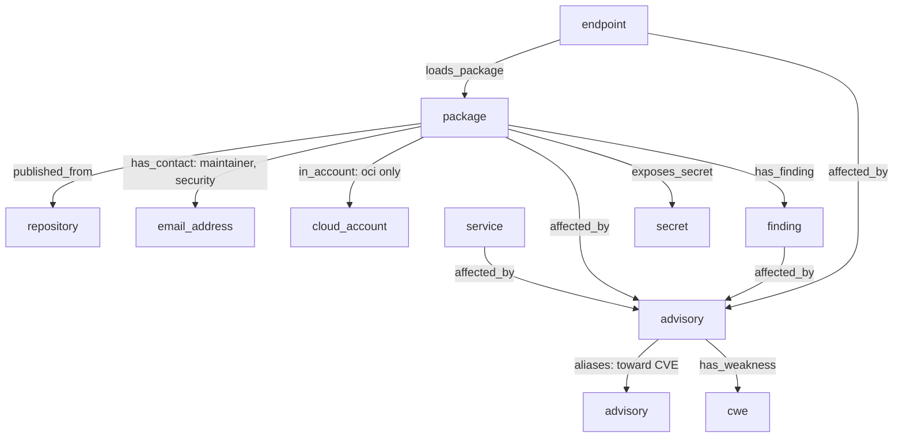

# Advisory and Published Package Types - Plan

## Goal Capsule

- **Objective:** An agent can record that a package or container image the target publishes is the target's asset, and connect it to the vulnerabilities, secrets, source repositories and maintainer contacts found for it. A vulnerability published only as a GHSA or OSV record is as usable a pivot as a CVE.
- **Means:** Generalize the `cve` node type into an `advisory` type and add one purl-keyed node type for published packages and images, in a breaking catalog cut (KTD1, KTD4).
- **Product authority:** The Product Contract wins on behavior, and the Planning Contract wins on mechanism within it. The scope is these two types and the relations they need. The other catalog-review follow-ups are not active scope; see How This Work Fits Together.
- **Stop conditions:** Stop and ask if a workspace created under v0.5.0 turns out to need keeping, or if a per-type ownership restriction (R10) cannot be enforced without changing the inventory rules for other carrying types.
- **Execution profile:** One feature branch and one PR carrying the breaking catalog cut. The commits follow the unit order below, and each passes `make check`.
- **Open blockers:** None.

---

## Product Contract

Product Contract preservation: changed. R9 keeps a container image's registry in its identity, and R10 refuses the `dependency` ownership on packages; the user approved both at the planning synthesis on 2026-10-01 after research showed that stripping every purl qualifier merges same-named images across registries. R6 is clarified to name where the guidance lives, because the server instructions carry no type-level text. AE9 and AE10 are added for the two changes.

### Summary

The catalog's `cve` type becomes an `advisory` type that accepts CVE, GHSA and OSV ids, with a writing rule that prefers the CVE id and an alias relation for ids learned later. A new node type represents a package or container image the target publishes, keyed by its versionless purl and carrying inventory state like the target's other assets. It links to its source repository, maintainer email, registry cloud account, the advisories that affect it, the secrets it exposes and its findings.

### Problem Frame

The graph is one part of a pentest framework in which AI agents gather data from any source: a browser visit that reads a Next.js version, then research that ties that version to an advisory. Two things such an agent finds today have no place to go.

First, many package vulnerabilities are published as GHSA or OSV records, and some never receive a CVE. The `cve` type accepts only `CVE-` ids, and `affected_by` targets only `cve` (`src/justpen_knowledgebase_mcp/catalog.py`). A GHSA-only vulnerability can be named in a finding's rule, but nothing can pivot on it.

Second, packages and container images the target publishes, such as an npm scope or a Docker Hub organization, are part of its attack surface. A secret baked into an image layer or a maintainer email on an expired domain is a supply-chain path into the target. `repository` accepts only source-hosting platforms, and `technology` is a shared product slug that carries no inventory state, so neither can hold "this package is the target's".

A check against the current catalog confirmed that the rest of this ground is already modeled. A component the target runs is `technology` reached through `runs_technology`, with the version on the edge. A dependency-confusion candidate leaked by a source map is a finding on the endpoint that leaked it. A secret in a package tarball can already hang on the tarball's endpoint, though not on the package as an asset.

### Actors

- A1. The agent: an AI agent in the pentest framework that writes observations, evidence and classifications to the graph through the MCP tools.
- A2. The operator: the human who reads the graph and decides what to test.

---

### Key Decisions

- **One `advisory` type replaces `cve`.** One concept keeps one type, and the "everything affected by this vulnerability" query stays on one type. Governs R1, R2, R3. (session-settled: user-approved — chosen over keeping `cve` beside a separate non-CVE `advisory` type, or adding no advisory node: a split type doubles every advisory query, and no node loses the package-to-GHSA pivot this work exists for)
- **Prefer the CVE id; link aliases learned later.** Most vulnerabilities then resolve to one node, and the alias relation covers only the exceptions. Governs R5, R6. (session-settled: user-approved — chosen over one node per id with no preference rule, or CVE only with no alias relation: the first makes every pivot follow aliases, the second leaves a GHSA that later gets a CVE split forever)
- **The package type covers only what the target publishes.** Components the target runs stay `technology`, so one component is never modeled twice. Governs R8, R10, R15. (session-settled: user-approved — chosen over also covering run components, adding a purl to `technology`, or no package type: covering run components collides with `technology`, and a purl on `technology` still cannot hold the target's own packages)
- **Package identity has no version.** One package is one asset with one classification; version-specific facts stay in evidence. Governs R9, R12. (session-settled: user-approved — chosen over a node per version or a latest-version property: per-version nodes multiply one asset by its release count and leave which versions get written to the agent)
- **A container image's identity keeps its registry.** Same-named images in different registries are different assets. Governs R9. (session-settled: user-approved — chosen over stripping every qualifier, or a separate registry property beside a bare purl: stripping merges Docker Hub, GHCR and ECR images, and a separate property makes the stored purl differ from the standard string)
- **A package is never a `dependency`.** A third-party package belongs to `technology`, so `dependency` on a package can only be a mistake. Governs R10. (session-settled: user-approved — chosen over allowing it, with or without a documentation warning: either leaves the published-only boundary to agent discipline)
- **Packages link to repository, maintainer email, cloud account and the endpoints that load them.** The maintainer email and cloud account expose supply-chain takeover paths. Governs R13, R15. (session-settled: user-directed — chosen from the offered set, all four selected)
- **No domain-to-package attribution relation.** Ownership state and its evidence say the package is the target's; the repository and maintainer email give the graph path back to the target. (session-settled: user-approved — chosen over a package analogue of `owns_repository`, confirmed at the scoping synthesis)
- **Break the catalog without migration.** No workspace created under v0.5.0 needs to be kept. Governs R17. (session-settled: user-directed — chosen over migrating `cve` nodes to `advisory`)

---

### Requirements

**Advisory**

- R1. The catalog replaces the `cve` node type with an `advisory` type: one published vulnerability record, identified by its id and shared by every object it affects.
- R2. An advisory id is accepted only when it matches a recognized vulnerability-id grammar: CVE, GHSA, or an OSV ecosystem id. Vendor and distribution bulletin ids, such as RHSA, DSA, USN and Microsoft KB numbers, are refused.
- R3. An advisory keeps the existing CVE properties (CVSS score and vector, publication time). The EPSS and CISA KEV properties are accepted only on a CVE id, because only CVEs are scored or listed there.
- R4. An advisory stores no applicability data (affected products, version ranges, references, descriptions); that stays in evidence, as the catalog review already rules for CVEs.
- R5. A relation between two advisories records that they name the same vulnerability.
- R6. The advisory, alias and `affected_by` descriptions that `kb_types` serves tell the agent to write the CVE id whenever it knows one for the vulnerability, and to add the R5 alias relation when it learns that a non-CVE advisory it wrote has a CVE.
- R7. `affected_by` targets `advisory`, and its sources are service, finding, endpoint and the published package type. Every relation that reached `cve` before reaches `advisory` instead.

**Published package**

- R8. A new node type represents a package or container image that the target publishes to a registry, in one type for both language-package and container-image registries.
- R9. Its identity is the package's purl without version or subpath, so every release of one package is one node; a container image keeps the registry repository it lives in, and every other qualifier is dropped.
- R10. It carries inventory state like the target's other assets: creating it requires an ownership, and the ownership rules and rejection tombstones already in force apply, except that `dependency` is refused on a package.
- R11. A package the agent cannot yet attribute is written as a candidate. A package proven not to be the target's is rejected and keeps only its identity, as R10's rules already provide.
- R12. Which releases contain a secret or vulnerability is recorded in evidence and in a finding's matcher, never as a version property or a version node.
- R13. A published package can be linked to its source repository, to a maintainer email address as a contact, and, for an image in a cloud provider's registry, to the cloud account that holds it.
- R14. A published package can expose a secret and carry findings, as the target's other assets do.
- R15. An endpoint can be linked to a published package it loads, for the target's own packages only; a third-party component the target loads stays a `technology` reached through `runs_technology`.

**Catalog contract**

- R16. The catalog reference, the catalog review, the ASM coverage mapping (NVD and FIRST EPSS fields now map onto `advisory`), the MCP instructions and the tool descriptions no longer name `cve` as a node type.
- R17. This is a breaking catalog cut. A workspace created under catalog v4 fails closed at startup, and no migration is provided.

---

### Acceptance Examples

- AE1. **Covers R2.** `CVE-2025-29927` and `GHSA-f82v-jwr5-mffw` are accepted as advisories. `RHSA-2025:1234` is refused, and the error names the advisory id rule.
- AE2. **Covers R3.** An EPSS score on `CVE-2025-29927` is accepted. The same property on a GHSA advisory with no CVE is refused.
- AE3. **Covers R5, R6, R7.** The agent finds a vulnerability in the target's `@acme/sdk` through GitHub and writes `GHSA-xxxx-xxxx-xxxx` with `affected_by` from the package. A week later it learns the CVE, writes the CVE advisory and links the two. Starting from the CVE, the agent reaches the package in one alias hop.
- AE4. **Covers R9, R12, R14.** The agent observes `@acme/sdk` at versions 1.2.3 and 2.0.0. The graph holds one package node. A secret found only in 1.2.3 is linked from that node through `exposes_secret`, and the evidence names version 1.2.3.
- AE5. **Covers R15.** `app.acme.com` loads Next.js 14.1 and the target's own `@acme/widget`. Next.js is a `technology` reached through `runs_technology` with version 14.1; `@acme/widget` is a published package linked from the endpoint that loads it.
- AE6. **Covers R10, R11.** An npm package `acme-sdk` from an unknown publisher is written as a candidate. Once evidence shows it is not the target's, the agent rejects it; only its identity remains, and a later write of the same purl is refused.
- AE7. **Covers R13.** An image in an AWS ECR registry is linked to the target's AWS `cloud_account`; an image on Docker Hub has no cloud account link.
- AE8. **Covers R17.** Starting the server on a workspace created under catalog v4 fails closed with the catalog-mismatch error.
- AE9. **Covers R9.** The target's `api` image in its ECR registry and an `api` image on Docker Hub are two package nodes. The same ECR image seen at tags `1.4` and `latest` is one node.
- AE10. **Covers R10.** Creating `pkg:npm/lodash` with ownership `dependency` is refused, and the error says a package cannot be a dependency.

---

### Scope Boundaries

- Typosquat and lookalike packages published by others, as digital-risk coverage. The earlier decision to exclude lookalike domains and social accounts applies. Such a package is written at most as a candidate and then rejected, per R11.
- Packages the target only depends on, and dependency inventories or SBOMs. Run components stay `technology`; a dependency-confusion candidate stays a finding on the endpoint that leaked its name.
- Vendor and distribution bulletins, per R2.
- Advisory applicability data, per R4.
- Automatic alias expansion in search, where a query for one id also returns objects linked to its aliases. The agent follows the alias relation itself in this work.
- Migrating v4 workspaces, per R17.

**Considered and not built**

- A server rule that makes `affected_by` target the CVE when a GHSA has a CVE alias. No catalog check can see a node's neighbors (KTD9); evidence that agents leave many split pivots would justify a storage-layer rule.
- Matching an ECR image's account id against the linked `cloud_account`. The bucket link checks the provider only, and the image link follows it (KTD7); a wrong-account link found in practice would justify the check.
- A version on the endpoint-to-package relation. R12 keeps versions in evidence; a need to query which page loads which release would change this.

**Deferred to Follow-Up Work**

- ASM fixtures for npm registry metadata and container registries. The development sandbox cannot reach those hosts, so this work covers them with catalog rule cases (KTD10).

---

### Dependencies / Assumptions

- The user confirmed on 2026-10-01 that no workspace created under v0.5.0 (catalog v4) needs to be kept.
- The inventory-state rules from the engagement inventory plan (`.compound-engineering/artifacts/plans/2026-09-30-1233-feat-engagement-inventory-state-plan.md`) apply to the new package type except where R10 narrows them.
- The server cannot know which GHSA or OSV id aliases which CVE, so R6's preference is guidance to the agent, not a server check. An agent that writes a GHSA without knowing its CVE leaves the pivot split until it adds the alias.
- About 1% of OSV ecosystem records alias two or more CVEs. Such a record links to each CVE, so "one id, one vulnerability" is an approximation the catalog documents rather than enforces.

---

### Sources / Research

- Current definitions: `cve`, `affected_by`, `has_weakness`, `repository`, `has_contact`, `in_account`, `exposes_secret`, `technology` and `runs_technology` in `src/justpen_knowledgebase_mcp/catalog.py`; rendered in `docs/reference/catalog.md`.
- "Advisory applicability data" is not modeled: `docs/reference/catalog-review.md`.
- NVD and FIRST EPSS field mapping onto `cve`: `docs/reference/asm-coverage.md`.
- Workspace compatibility: `SchemaGuard` refuses any catalog-fingerprint change, so a type change fails closed even without a version bump (`src/justpen_knowledgebase_mcp/storage/schema.py`). The catalog version is raised by convention, as for v3 and v4.
- CVE id grammar: CVE JSON 5 record schema, `cveId` (https://github.com/CVEProject/cve-schema).
- GHSA id grammar and OSV id prefixes, `aliases` semantics: OSV schema 1.9.1 (https://ossf.github.io/osv-schema/) and the GitHub Advisory Database (https://github.com/github/advisory-database).
- purl: the purl specification and type definitions (https://github.com/package-url/purl-spec); PyPI names follow the PyPA name-normalization rule (https://packaging.python.org/en/latest/specifications/name-normalization/), not the purl type note.
- Artifact Registry image names: https://cloud.google.com/artifact-registry/docs/docker/names.

---

<!-- ce-section: work-relationships -->
### How This Work Fits Together

This plan covers the advisory generalization and the published package type. The breakdown below is the current understanding from the catalog review and its re-check on 2026-10-01; it is not a committed roadmap.

- Fixes to existing types. Can proceed independently of this plan, and shares its catalog cut, so both could ship in one breaking release.
  - `service` keyed by name under a port, so two scanners create two services on one listener.
  - `dns_name` accepting non-ICANN internal names such as `corp.internal`.
  - `registrar` requiring an IANA id that most ccTLD registrars lack.
  - `tls_fingerprint` lacking JA4 and HASSH, subject to a licensing check.
  - No relation from `cloud_account` to `identity_tenant`; `cloud_resource` unable to hold resources without a default hostname.
  - `cloud_resource`'s provider list extended to takeover-prone platforms (Heroku, GitHub Pages, Vercel, Netlify, Shopify). Subdomain takeover itself is already a finding on the subdomain.
  - `http_fingerprint` gaining analytics and tag-manager ids as kinds, as ownership pivots.
- Still to decide: an organization platform account (GitHub or Docker Hub organization) as a node. `repository.owner` already carries the name, so the gap is only a place for organization-level findings.
- Dropped on re-check, because the catalog already models them: a web origin type (endpoints carry scheme, host and port in their URL) and a file or JavaScript resource type (`http_fingerprint` body digests and `exposes_secret` from endpoints).

---

## Planning Contract

### Key Technical Decisions

- KTD1. **Advisory ids pass a strict per-prefix allow-list; the server never rewrites case.** The accepted prefixes are CVE, GHSA, PYSEC, RUSTSEC, GO, OSV, HSEC, JLSEC, OSEC, RSEC, EEF, DRUPAL and MAL, each with its own id grammar kept in one constant that tests lock. GHSA keeps an uppercase prefix and a lowercase body from its restricted alphabet; every other id is uppercase. Excluded: GSD (dormant), PSF, LBSEC, KUBE, V8 and CURL (no observed id shape to validate), the Android bulletin ids ASB-A and PUB-A, EUVD (not an OSV database) and every distro or vendor bulletin. Strict validation without rewriting matches the repo, where `dns_name`, `email_address` and repository names refuse non-canonical spellings and agents normalize through ASM transforms. Governs R1, R2. (session-settled: user-approved — MAL accepted over refusing it: a malicious-package record marks a compromised release of the target's own package, the core supply-chain case)
- KTD2. **EPSS and KEV on a non-CVE id are refused by a node check.** The check refuses `epss_score`, `epss_percentile` and `kev_added` unless the id is a CVE, following `cloud_resource_hostname.1`, which refuses an optional property by another property's value. Checks rerun on merged stored properties, so a later patch adding EPSS to a GHSA is refused too. Governs R3.
- KTD3. **The alias relation `aliases` points toward the CVE.** Its source and target are advisories, self edges are off, and an endpoint check fixes direction: the target's id family ranks at least as high as the source's (CVE above GHSA above every OSV ecosystem id), equal ranks go from the alphabetically lower id to the higher, and two CVEs are refused. Each pair therefore has one edge, and a pivot from a CVE reaches its aliases in one hop. The pattern is `contains_cidr` with `contains_cidr_proper_subnet.1`. Governs R5. (session-settled: user-approved — chosen over unchecked direction or a purely alphabetical order: unchecked allows two edges per pair, and alphabetical order does not guarantee the CVE is the target)
- KTD4. **The package type is `package`, keyed on one canonical purl string.** Accepted purl types are npm, pypi, maven, nuget, gem, cargo, golang, composer and oci; `docker` is refused because it has no settled place for the registry, so images are written as `oci`. The validator refuses a version, a subpath and every qualifier except `repository_url`, which an `oci` purl requires and which holds the normalized registry host and repository path, with Docker Hub spelled `docker.io` and its official images under `library/`. Each type gets its own canonical-name rule (npm scope encoded as `%40`, PyPI names normalized by the PyPA rule, a namespace required for maven, composer and golang), and non-canonical input is refused rather than rewritten, as in KTD1. Governs R8, R9.
- KTD5. **The catalog declares which ownerships a carrying type accepts.** A carrying type may list its allowed ownership values; `package` lists owned, candidate and rejected, and every other type keeps all four by default. The write path refuses a disallowed ownership at creation and at ID reclassification, with an error naming the type. The list is part of the catalog manifest, so it is fingerprinted and shown by `kb_types`. Governs R10, AE10.
- KTD6. **`has_contact` gains a `maintainer` role, restricted to packages.** A package source may use only `maintainer` and `security`, and only toward an `email_address`; `maintainer` is refused from every other source. This extends `has_contact_registration_roles.1`, which today returns early for every source outside registrations. Governs R13.
- KTD7. **`in_account` accepts an `oci` package and derives its provider from the registry host.** ECR hosts map to aws, Artifact Registry and `gcr.io` hosts to gcp, and `*.azurecr.io` to azure; any other registry and any non-`oci` package are refused. This mirrors the bucket-to-provider table, and it also removes the KeyError the current provider lookup would raise on a package source. Governs R13, AE7.
- KTD8. **The new package relations are `published_from` and `loads_package`.** `published_from` runs from a package to its source repository, and `loads_package` from an endpoint to a package. Neither is a reliance relation, so an owned endpoint that loads a package does not block rejecting it, and rejection purges both like any other incident edge. Governs R13, R15.
- KTD9. **The CVE preference lives in catalog prose, not in a check.** Node checks see one record and endpoint checks see one edge and its two endpoints, so no check can ask whether a GHSA already has a CVE alias. The advisory, `aliases` and `affected_by` descriptions carry the rule, and `kb_types` serves them to agents. Governs R6.
- KTD10. **Two real-tool fixtures prove the new types against captured output.** A `github_advisory` source records GitHub REST API global-advisory responses (GHSA id, CVE alias, CVSS), and a `pypi_json` source records PyPI JSON API responses (package, maintainer email, source repository URL). Both hosts are reachable from the development sandbox, and `github_repository` is the precedent for a GitHub REST API source. A new transform turns a PyPI project name into its canonical purl. Governs R2, R3, R5, R9, R13.
- KTD11. **The review-ledger test tracks additions per catalog version.** `tests/test_catalog_reference.py` hard-codes the v3 additions and their counts; it becomes a per-version record so v5's renamed and new types each need a verdict row in `docs/reference/catalog-review.md`. Governs R16.

### High-Level Technical Design

The new and changed graph shape, with the existing types they touch:

The alias direction rule of KTD3:

| Source family | Target family | Accepted |
|---|---|---|
| OSV ecosystem id | GHSA or CVE | yes |
| GHSA | CVE | yes |
| Same family, not CVE | Same family | only from the alphabetically lower id |
| CVE | CVE | no |
| Higher family | Lower family | no |

### Sequencing

U1 renames the type, so every later unit builds on `advisory`. U3 lands the package type before U4 adds its relations. U5 adds the new fixture sources only after every type and relation they write exists. U6 raises the catalog version once, after the type set is final.

Every commit stays green, because several `make check` tests pin the whole catalog: the fingerprint pin in `tests/test_catalog.py`, the byte-for-byte page comparison and review ledger in `tests/test_catalog_reference.py`, and the fixture validation in `tests/test_asm_coverage.py`. Each unit that changes the catalog therefore, in its own commit:

1. re-pins the catalog fingerprint;
2. adds or updates the review-ledger rows for the types and relations it adds or renames;
3. regenerates the reference and coverage pages with `make docs-catalog`.

U1 also retargets the existing `cve` fixture sinks and restructures the ledger test (KTD11), since the rename breaks both at once.

---

## Implementation Units

### U1. Replace `cve` with `advisory`

- **Goal:** The catalog has an `advisory` type with the per-prefix id grammar and the CVE-only EPSS/KEV check, and no `cve` type remains.
- **Requirements:** R1, R2, R3, R4, R7 (target side), R16 (fixture mappings), KTD1, KTD2, KTD11.
- **Dependencies:** None.
- **Files:**
  - `src/justpen_knowledgebase_mcp/catalog.py`
  - `src/justpen_knowledgebase_mcp/catalog_docs.py`
  - `tests/catalog_golden.py`
  - `tests/test_catalog.py`
  - `tests/test_catalog_reference.py`
  - `tests/unit/test_graph.py`
  - `tests/storage/graph_fixtures.py`
  - `tests/storage/test_graph.py`
  - `tests/storage/test_search.py`
  - `tests/fixtures/asm/nvd_cve/mapping.json`, `tests/fixtures/asm/nvd_cve/writes.json`
  - `tests/fixtures/asm/first_epss/mapping.json`, `tests/fixtures/asm/first_epss/writes.json`
  - `tests/fixtures/asm/nuclei/mapping.json`, `tests/fixtures/asm/nuclei/writes.json`
  - `tests/fixtures/asm/bbot/mapping.json`
  - `docs/reference/catalog-review.md`
  - `docs/reference/catalog.md`, `docs/reference/asm-coverage.md` (generated)
- **Approach:**
  1. Replace the `cve` format with an `advisory_id` format whose validator applies the KTD1 allow-list; remove the `cve` format, its docs and its golden cases together, because an unused format fails the import guard.
  2. Rename the node, keep its optional properties, and add the KTD2 check to `_CHECKS` with its doc and golden cases.
  3. Point `affected_by`'s target and `has_weakness`'s source at `advisory`, and rewrite the prose that names CVEs (`affected_by`, `has_weakness`, the `finding` and `has_finding` exclusions, the `cwe` exclusion).
  4. Update every test reference the repo research listed; the storage refusal message names the type, so its pinned pattern changes.
  5. Retarget every `cve` sink and write in the `nvd_cve`, `first_epss`, `nuclei` and `bbot` fixtures to `advisory`.
  6. Restructure the ledger test per KTD11 and turn the `cve` verdict row into an `advisory` row.
  7. Re-pin the fingerprint and regenerate the reference and coverage pages, per Sequencing.
- **Patterns to follow:** `cloud_resource_hostname.1` for the conditional property refusal; the existing `cve` entry for property docs.
- **Test scenarios:**
  - Covers AE1. `CVE-2025-29927` and `GHSA-f82v-jwr5-mffw` validate; `RHSA-2025:1234`, `DSA-5555-1`, `USN-6000-1`, `GSD-2021-1000011` and `ASB-A-123456789` are refused.
  - One accepted and one refused id per allow-listed prefix, including `MAL-2025-191157`, `RUSTSEC-2024-0001`, `GO-2024-2687` and `PYSEC-2005-1`.
  - `ghsa-f82v-jwr5-mffw`, `GHSA-F82V-JWR5-MFFW`, `GHSA-f82v-jwr5-mff1` (digit outside the alphabet) and `cve-2025-29927` are refused.
  - Covers AE2. EPSS on a CVE advisory validates; EPSS, EPSS percentile or KEV on a GHSA advisory is refused.
  - A GHSA advisory written without EPSS and later patched by ID with `epss_score` is refused.
  - `affected_by` from service, endpoint and finding to an advisory validates; `has_weakness` from an advisory to a cwe validates.
  - A state field on an advisory is refused with the "carries no inventory state" message naming `advisory`.
- **Verification:** `make check` passes on the U1 commit, and no `cve` type, format or relation endpoint remains in the manifest or the fixture mappings.

### U2. Add the `aliases` relation

- **Goal:** Two advisories can be linked as the same vulnerability, with one edge per pair pointing toward the CVE.
- **Requirements:** R5, R6, KTD3, KTD9.
- **Dependencies:** U1.
- **Files:**
  - `src/justpen_knowledgebase_mcp/catalog.py`
  - `src/justpen_knowledgebase_mcp/catalog_docs.py`
  - `tests/catalog_golden.py`
  - `tests/test_catalog.py`
  - `tests/storage/test_graph.py`
  - `docs/reference/catalog-review.md`
  - `docs/reference/catalog.md` (generated)
- **Approach:**
  1. Declare `aliases` from advisory to advisory with self edges off and an endpoint check implementing the KTD3 table.
  2. Write the relation's description, and add the R6 writing rule to the advisory and `affected_by` descriptions.
  3. Add the `aliases` ledger row, re-pin the fingerprint and regenerate the pages, per Sequencing.
- **Patterns to follow:** `contains_cidr` and `contains_cidr_proper_subnet.1`.
- **Test scenarios:**
  - GHSA to CVE, PYSEC to GHSA and PYSEC to CVE validate.
  - CVE to GHSA, GHSA to PYSEC and CVE to CVE are refused, each naming the check.
  - Two GHSA ids validate only from the alphabetically lower to the higher.
  - An advisory aliasing itself is refused as a self edge.
  - Covers AE3. Through the write path, a package affected by a GHSA, then a CVE written and aliased, lets a neighbor query from the CVE reach the GHSA and from it the package.
- **Verification:** The relation matrix and golden endpoint cases pass, and the `kb_types` description of `advisory` states the CVE preference.

### U3. Add the `package` type and per-type ownership

- **Goal:** A package or image the target publishes can be written under its canonical purl, carrying inventory state without `dependency`.
- **Requirements:** R8, R9, R10, R11, R12, KTD4, KTD5.
- **Dependencies:** None (U1 only touches different entries).
- **Files:**
  - `src/justpen_knowledgebase_mcp/catalog.py`
  - `src/justpen_knowledgebase_mcp/catalog_docs.py`
  - `src/justpen_knowledgebase_mcp/storage/graph.py`
  - `src/justpen_knowledgebase_mcp/tools/graph.py`
  - `tests/catalog_golden.py`
  - `tests/test_catalog.py`
  - `tests/storage/test_graph.py`
  - `docs/reference/catalog-review.md`
  - `docs/reference/catalog.md` (generated)
- **Approach:**
  1. Add a `package_purl` format and validator per KTD4, with the per-type name rules and the Docker Hub spelling.
  2. Add the `package` node with inventory `carries`, identity on its purl, and the description that explains the published-only boundary.
  3. Add the optional allowed-ownership list to the catalog's node contract, validate it at import (carrying types only, a subset of the four ownerships), and include it in the manifest.
  4. Make the carried-state planning refuse an ownership the type does not allow, at creation and at ID reclassification.
  5. Amend the `kb_write` and `kb_types` tool descriptions, which today promise every carrying type `owned`, `dependency` or `candidate`, to say a type may narrow that list.
  6. Add the `package` ledger row, re-pin the fingerprint and regenerate the pages, per Sequencing.
- **Patterns to follow:** `_ensure_inventory_contract` for the import guard; `_plan_carried_state` in `src/justpen_knowledgebase_mcp/storage/graph.py` for the refusal; `repository_owner_spelling.1` for per-variant spelling rules.
- **Test scenarios:**
  - `pkg:npm/%40acme/sdk`, `pkg:pypi/acme-sdk`, `pkg:maven/com.acme/sdk`, `pkg:golang/github.com/acme/sdk` and `pkg:oci/api?repository_url=123456789012.dkr.ecr.us-east-1.amazonaws.com/acme/api` validate.
  - A purl with a version, a subpath, a `tag` or `arch` qualifier, an `oci` purl without `repository_url`, a `docker` purl, and an unlisted type are refused.
  - `pkg:pypi/Acme_SDK`, `pkg:npm/@acme/sdk` (unencoded scope), a maven purl without namespace, and `repository_url=index.docker.io/library/nginx` are refused as non-canonical.
  - Covers AE9. The ECR `api` image and `pkg:oci/api?repository_url=docker.io/acme/api` have different identities.
  - Covers AE10. Creating a package with ownership `dependency` is refused; reclassifying a candidate package to `dependency` by ID is refused; creating a `domain` with `dependency` still succeeds.
  - Covers AE6. A candidate package rejected by ID keeps only its identity, and a later identity write of the same purl is refused as a rejected identity.
  - The import guard refuses an allowed-ownership list on a non-carrying type and a list naming an unknown ownership.
  - The `kb_types` response for `package` lists owned, candidate and rejected as its allowed ownerships.
- **Verification:** Package writes follow the existing inventory flows, and an agent reading only the tool descriptions and `kb_types` learns that a package cannot be a dependency.

### U4. Wire the package relations

- **Goal:** A package links to its repository, maintainer and security emails, its registry's cloud account, the endpoints that load it, the advisories that affect it, its secrets and its findings.
- **Requirements:** R7 (source side), R13, R14, R15, KTD6, KTD7, KTD8.
- **Dependencies:** U1, U3.
- **Files:**
  - `src/justpen_knowledgebase_mcp/catalog.py`
  - `src/justpen_knowledgebase_mcp/catalog_docs.py`
  - `tests/catalog_golden.py`
  - `tests/test_catalog.py`
  - `tests/storage/test_graph.py`
  - `docs/tools/graph.md`
  - `docs/reference/catalog-review.md`
  - `docs/reference/catalog.md` (generated)
- **Approach:**
  1. Declare `published_from` and `loads_package`.
  2. Add `package` as a source of `affected_by`, `exposes_secret`, `has_finding`, `has_contact` and `in_account`.
  3. Add the `maintainer` role and extend the contact-role check per KTD6.
  4. Extend the provider lookup and its consistency guard with the registry-host table per KTD7.
  5. Update the relation prose, including the `docs/tools/graph.md` passage on which types can carry findings.
  6. Add the `published_from` and `loads_package` ledger rows, re-pin the fingerprint and regenerate the pages, per Sequencing.
- **Patterns to follow:** `_BUCKET_ACCOUNT_PROVIDER` and `_ensure_cross_field_contract` for the registry table; `has_contact_endpoint_role.1` for role restrictions.
- **Test scenarios:**
  - Covers AE7. An ECR image to an aws account validates; an Artifact Registry image to a gcp account and an ACR image to an azure account validate.
  - An ECR image to a gcp account, a Docker Hub or GHCR image to any account, and an npm package to any account are refused as validation errors, not internal errors.
  - A package to an email with role `maintainer` or `security` validates; `registrant`, `billing` and a phone or endpoint target from a package are refused; `maintainer` from a domain is refused.
  - Covers AE5. `loads_package` from an endpoint to the target's package validates, alongside `runs_technology` to a technology on the same endpoint.
  - Covers AE4. Two observations of one package at different versions produce one node, and `exposes_secret` from it validates.
  - A package with `has_finding`, `published_from` and an owned endpoint loading it can be rejected; the rejection purges those edges and leaves the repository, email and endpoint.
- **Verification:** The relation matrices list every new source and target, and each new rule has golden accept and reject cases.

### U5. Add the advisory and package fixture sources

- **Goal:** Two new sources prove GHSA ids, aliases, packages and maintainer contacts against captured real tool output.
- **Requirements:** R2, R3, R5, R9, R13, KTD10.
- **Dependencies:** U1, U2, U3, U4.
- **Files:**
  - `tests/fixtures/asm/github_advisory/` (new: captured responses, `SOURCE.md`, `mapping.json`, `writes.json`)
  - `tests/fixtures/asm/pypi_json/` (new: captured responses, `SOURCE.md`, `mapping.json`, `writes.json`)
  - `scripts/asm_transforms.py`
  - `tests/test_asm_coverage.py`
  - `tests/tools/test_asm_fixtures.py`
  - `docs/reference/asm-coverage.md` (generated)
- **Approach:**
  1. Capture a GHSA advisory with a CVE alias and a GHSA with none, and map the id, CVE alias, CVSS and publication time; mark affected-package ranges and descriptions non-storable per R4.
  2. Capture PyPI JSON for a real project with a maintainer email and source URL, and map the project to a package, the email to a maintainer contact and the source URL to `published_from`.
  3. Add the PyPI-name-to-purl transform, raise the expected source count, and regenerate the coverage page.
- **Patterns to follow:** `tests/fixtures/asm/github_repository/` for a GitHub REST API source; `tests/fixtures/asm/nvd_cve/` for an advisory source.
- **Test scenarios:**
  - Every mapping sink names a declared property of `advisory` or `package`.
  - Every fixture write validates against the catalog and equals its canonical form.
  - The GHSA fixture's writes include a GHSA advisory, its CVE advisory and the `aliases` edge toward the CVE.
  - The PyPI fixture's writes include a candidate package under its PyPA-normalized purl, a maintainer `has_contact` and a `published_from` edge.
  - The transform turns `Zope.Interface` and `zope__interface` into `pkg:pypi/zope-interface`.
  - The integration replay in `tests/tools/test_asm_fixtures.py` replays both new sources through the MCP tools.
- **Verification:** The ASM coverage tests and the fixture replay pass with 26 sources.

### U6. Cut catalog v5 and update the docs

- **Goal:** The contract is v5, v4 workspaces fail closed, and every reader-facing page describes `advisory` and `package`.
- **Requirements:** R16, R17.
- **Dependencies:** U1 through U5.
- **Files:**
  - `src/justpen_knowledgebase_mcp/catalog.py`
  - `tests/test_catalog.py`
  - `tests/storage/test_schema.py`
  - `tests/unit/test_schema.py`
  - `docs/reference/catalog.md` (generated)
  - `docs/reference/asm-coverage.md` (generated)
  - `docs/guides/graph.md`
  - `docs/tools/graph.md`
  - `docs/index.md`
  - `README.md`
- **Approach:**
  1. Raise `CATALOG_VERSION` to 5 and its docstring, pin the final fingerprint, and keep the released v4 fingerprint as the old-contract constant.
  2. Add the v4 fail-closed and guard-rejection tests beside the v2 and v3 ones.
  3. Regenerate the reference pages, and update the version and CVE prose in the guide, the tools page, the index and the README.
- **Patterns to follow:** the v3 and v4 cut commits (`bcdd11d`, `bbefe39`), which touched the same file set.
- **Test scenarios:**
  - Covers AE8. A workspace created under the v4 contract fails closed with the catalog-mismatch error.
  - The schema guard rejects the v4 contract tuple.
  - The generated pages match the generator byte for byte.
- **Verification:** `make docs-build` passes, and searching the docs and README for a `cve` type reference finds none.

---

## Verification Contract

| Gate | Command | Applies to |
|---|---|---|
| Focused development | `make test-one TEST=tests/test_catalog.py`, `make test-one TEST=tests/storage/test_graph.py`; `make test-one TEST=tests/test_asm_coverage.py` for U1 and U5 | U1-U5 while developing |
| Unit gate | `make check` | every commit (pre-push runs it on the branch tip) |
| Generated docs | `make docs-catalog`, then `make docs-build` | every unit that changes the catalog (U1-U4, U6) and U5 |
| Fixture replay | `make test-one TEST=tests/tools/test_asm_fixtures.py` | U5 (CI runs the full integration suite) |

---

## Definition of Done

- Every unit's verification holds, and `make check` and `make docs-build` pass on the final commit.
- No `cve` node type, format or relation endpoint remains in the catalog, tests, generated docs or hand-written docs; `CVE` survives only as an id prefix, a source name and evidence text.
- The catalog contract is v5, its fingerprint is pinned, and a v4 workspace fails closed.
- The commit that changes the contract carries a `BREAKING CHANGE:` footer naming the `cve` rename and the v4 fail-closed behavior.
- No experimental or abandoned code from rejected approaches remains in the diff.
